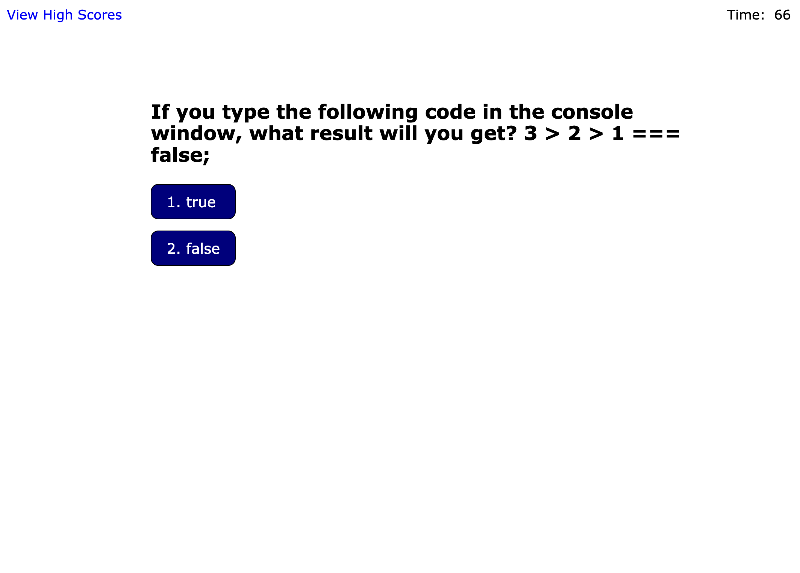
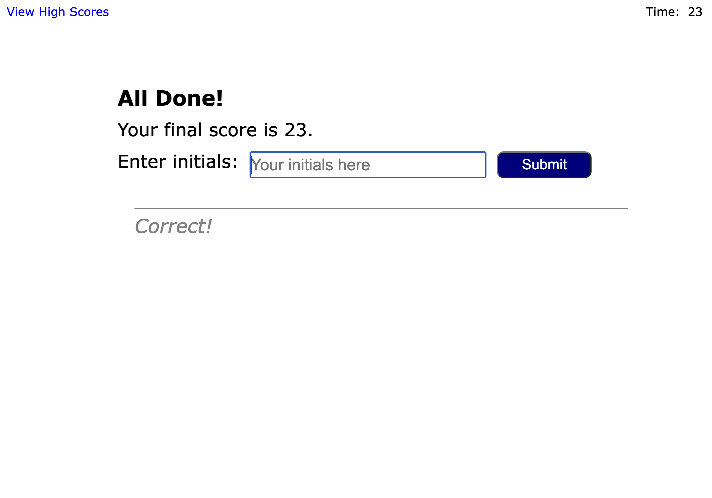
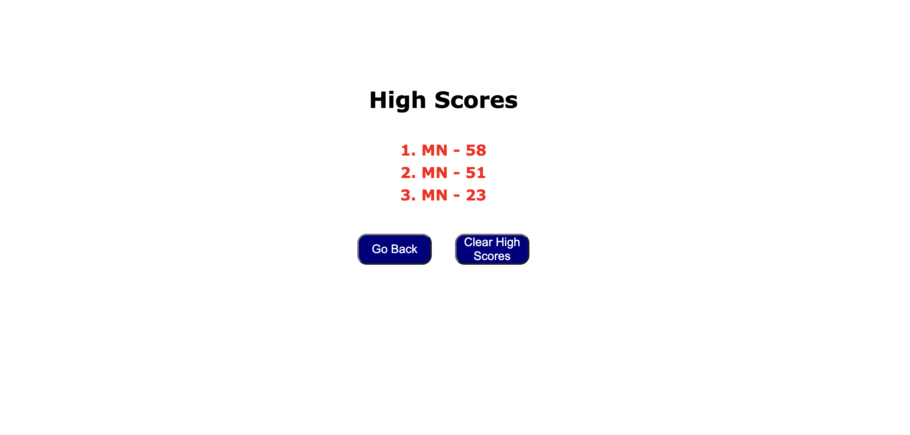

# Javascript Knowledge Game

## Description

This ia a game to test your JavaScript skills. The game is designed as a Quiz that prompts the user wih a series of questions with multiple choice answers. It is intended for everyone who wishes to learn the JavaScript programming language by passing tests.  

The user must complete the test before the clock runs out. If the user guesses the wrong answer, he is penalized 10 seconds, which in turn is subtracted from the clock. In order to Win the game, user must answer all questions before the clock runs out. At the end of the game, he is presented with a score, which is the amount of seconds left on the clock.

 At the end of the game, the user must enter his initials and submit the score, ending with a list of all high scores displayed. The high scores are saved in local storage, allowing the user to view a history of high scores, sorted in descending order.

---

## Usage

To visit site, navigate to the following HTTP address:

[https://mikeyboxx.github.io/code-quiz-game/](https://mikeyboxx.github.io/code-quiz-game/)

---

## Screenshot

The following images show the web application's appearance and functionality:

---

