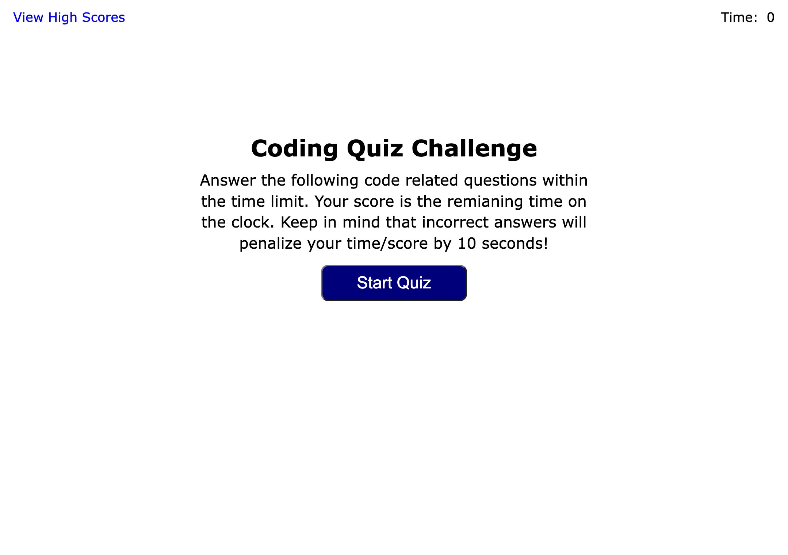

# Refactor codebase that follows accessibilty standards

## Description

---

## Usage

To visit site, navigate to the following HTTP address:

[https://mikeyboxx.github.io/code-quiz-game/](https://mikeyboxx.github.io/code-quiz-game/)

---

## Screenshot

The following image shows the web application's appearance and functionality:

---

## Tests

1. Visit site and make surte it is responsive to most moibile devices
2. Make sure all links are functional
3. Make sure that img tags have the alt parameter set for accessibility
4. Make sure that there are no non-semantic tags in the HTML viewed in DevTools

